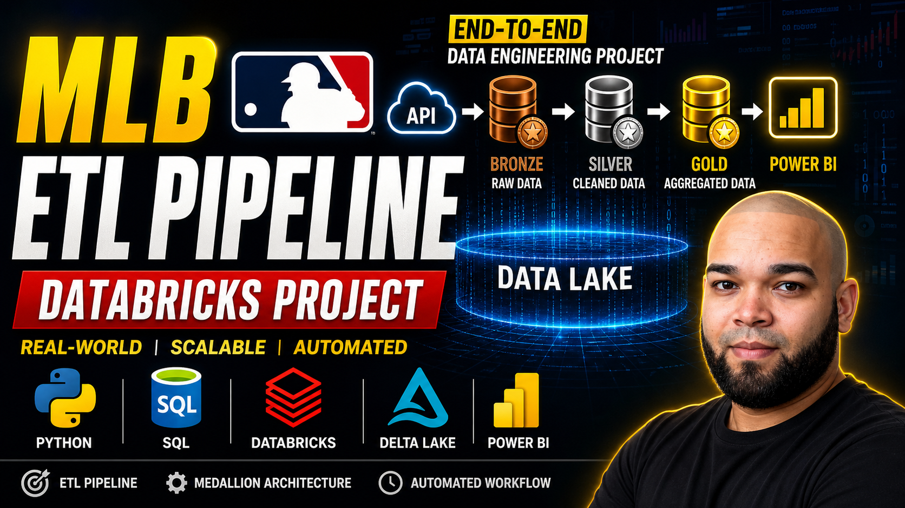
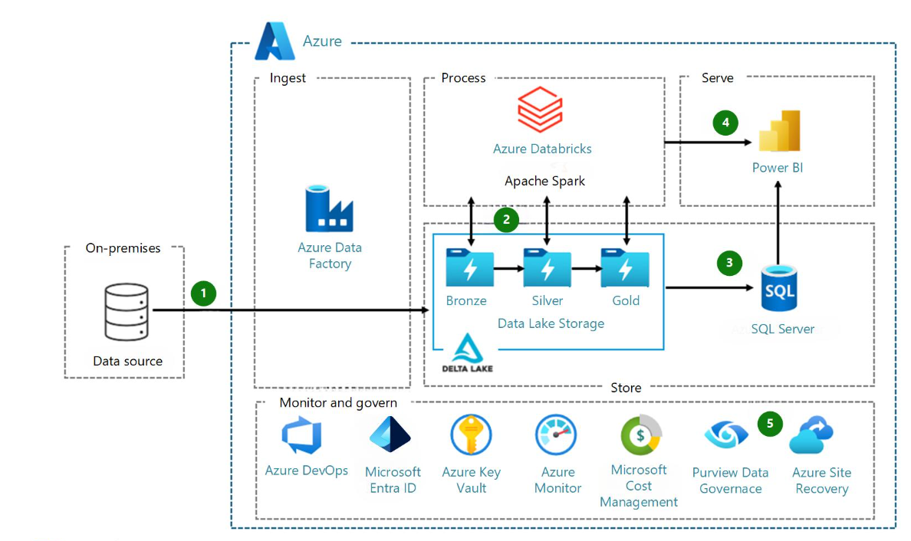
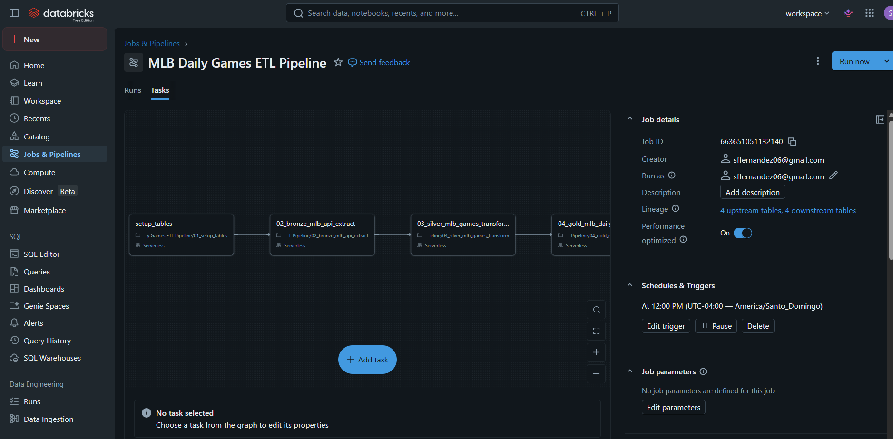

<p align="center">
  
</p>

# MLB Daily Games ETL Pipeline
Production style ETL pipeline built with Databricks, featuring API ingestion, Delta Lake MERGE, Medallion Architecture, and automated daily execution.

# ⚾ MLB Daily ETL Pipeline using Databricks

## 👤 Author

**Stanly Fernández**
Industrial Engineer | Data Analyst | Aspiring Data Engineer

---

## 🚀 Project Overview

This project implements an **end-to-end ETL pipeline** using **Databricks, PySpark, and Delta Lake**.

The pipeline extracts daily MLB game data from a public API, processes it using the **Medallion Architecture**, and stores it in structured tables ready for analytics and visualization.

---

## 🏗️ Medallion Architecture

<p align="center">
  
</p>

```
API → Bronze → Silver → Gold → BI Tools
```

### 🔹 Bronze Layer

* Raw JSON data ingestion from API
* Stored without transformation
* Ensures traceability

### 🔹 Silver Layer

* Data cleaning and transformation
* Structured schema (teams, scores, status)
* Delta Lake MERGE (upsert logic)

### 🔹 Gold Layer

* Aggregated metrics
* Business-ready data
* Used for dashboards

---


## ⚙️ Technologies Used

| Tool          | Description               |
| ------------- | ------------------------- |
| 🧠 Databricks | Data platform             |
| 🐍 Python     | Data ingestion            |
| 🔥 PySpark    | Data processing           |
| 🟦 SQL        | Queries & transformations |
| 🧊 Delta Lake | Storage & MERGE           |
| 🌐 REST API   | Data source               |
| 📊 Power BI   | Visualization (planned)   |

---

## ⚙️ Workflow Automation

<p align="center">
  
</p>

1. Extract data from MLB API
2. Store raw data in Bronze
3. Transform data in Silver
4. Aggregate metrics in Gold
5. Automate execution via workflow

---

## ⏱️ Automation

* Pipeline scheduled to run **daily at midnight**
* Implemented using **Databricks Workflows**
* Includes logging and monitoring

---

## 🎥 Project Demo

📹 Video Explanation:
👉 https://youtu.be/oDlRG3iUFq8

---

## 📂 Databricks Implementation

🔗 Databricks Workspace:
👉 https://dbc-05963ad7-c763.cloud.databricks.com/browse/folders/964238745135580?o=7474655078902957

> Note: Access may be restricted. Code is fully replicated in this repository.

## 💼 Business Value

This pipeline simulates a real-world data engineering solution by:

* Automating data ingestion
* Ensuring data quality
* Providing structured datasets for analytics
* Supporting data-driven decision making

---

## 📬 Contact

📧 Email: [sffernandez06@gmail.com](mailto:sffernandez06@gmail.com)
📱 Phone: +1 (809) 514-1912
🔗 LinkedIn: http://linkedin.com/in/stanly-fernandez
💻 GitHub: https://github.com/Stanly06

---

## ⭐ Final Note

This project demonstrates my ability to design and implement scalable data pipelines using modern data engineering tools.

I am currently open to opportunities in **Data Analytics and Data Engineering**.
